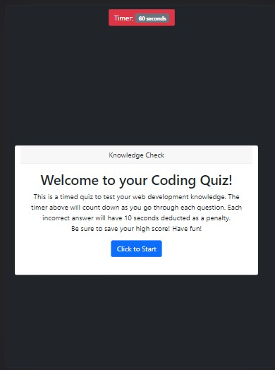

# CodR-Quiz

This application uses JavaScript and Web API to create a timed, multiole choice coding assessmwent.

View the deployed application by [clicking this link](https://tresha-gaye.github.io/CodR-Quiz/).

**Criteria and Accomplishment**

- the app runs in the browser and feature dynamically generated HTML and CSS powered by JavaScript. 
- the app features a polished user interface and be responsive, adapting to multip screen sizes.
- features include: a countdown timer that is responsive to correct and incorrect answers; the ability for the user to save their high score.

The app has been substantially improved so that the questions now populate, accepts user responses, moves on to the next questions, deducts more time for incorrect answers, and saves and displays high score. 

Additional functionality will be included in version 3 to: add more than one high score at a time, allow user to include name/initials when saving high score. 

Below are screenshots of the app as of today:

## Challenges

The app now meets the majority of user requirements, will continue to be updated.

## Contributing

## Credits

**The following resources were used to complete this project:**
1. UCONN Coding Bootcamp's modules on JavaScript
2. MDN resources [Mozilla Web Docs] (https://developer.mozilla.org/en-US/docs/Learn/JavaScript)

## License
[GNU](https://opensource.org/licenses/GPL-3.0)

